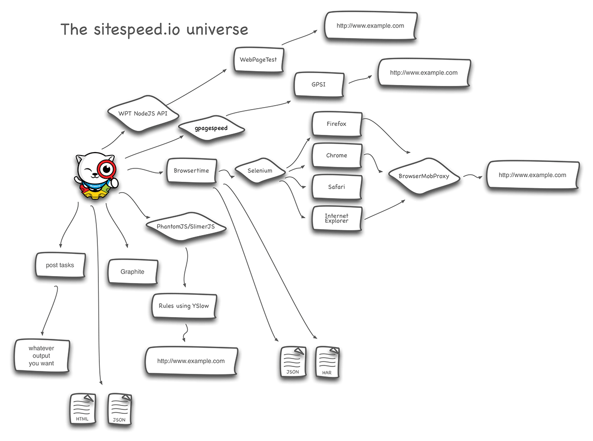

[Documentation 3.x](/documentation/) / Developers

# Developers
{:.no_toc}

* Lets place the TOC here
{:toc}

You can fork the project at [GitHub](https://github.com/sitespeedio/sitespeed.io)  and create your own version or contribute to the existing one. The master branch is the latest release and/or in production-ready state. Clone that and you know it will always work.

## The map

{: .img-thumbnail}

## Add your own post tasks

When sitespeed.io collected all the metrics, you have the possibility to add your own post tasks, meaning writing your own NodeJS code to take all the metrics and do whatever you want with it (store it to a database etc).

You add your own post task (you can have multiple) in an directory and feed the directory name and path to sitespeed, like this:

~~~bash
$ sitespeed.io -u https://www.sitespeed.io --postTasksDir myPostTaskDir
~~~

In that directory, create a file and follow the following standard:

~~~javascript
exports.task = function(result, config, cb) {
  console.log('yep this is my task running!')
  cb();
};
~~~

The task will be called with the following:
* **result** - a JSON that contains all the metrics collected. Print it out to see exactly how it is constructed
* **config** -  the sitespeed.io configuration object, contains info about the run and where to store the data
* **cb** - the callback to call when you are finished.

All post tasks runs in parallell.

## Create a new feature request
If you have ideas of how sitespeed.io can be improved or if you have any features that you think is missing, please add it to the [issue list](https://github.com/sitespeedio/sitespeed.io/issues?labels=&amp;milestone=&amp;page=1&amp;state=open").

## Add your own rules
Sitspeed uses [YSlow](http://yslow.org/) as the engine for creating and managing the rules that decides how good the web page is optimized for performance.  [Stoyan Stefanov](https://twitter.com/stoyanstefanov) has written three good blog posts of how you develop and write rules for YSlow:

* [Getting started](http://www.phpied.com/yslow-development-getting-started/)
* [Setup](http://www.phpied.com/yslow-development-setup/)
* [Custom ruleset](http://www.phpied.com/yslow-development-custom-rulesets/)

To do it for sitespeed, this is what you need:

Clone the project

~~~
git clone git@github.com:sitespeedio/yslow.git
~~~

There are two files that you need to change, first the [rule file](https://github.com/sitespeedio/yslow/blob/master/src/common/rulesets/ruleset_sitespeed.js), where you add your own rule.

You need to do two changes: Add your rule *YSLOW.registerRule(...)* and register your rule to the ruleset *YSLOW.registerRuleset(...)*

In this example, I will add a rule called **cssprint** that will check for css files used only for printing the page:

~~~
YSLOW.registerRule({
id: 'cssprint',
name: 'Do not load print stylesheets, use @media type print instead',
info: 'Loading a specific stylesheet for printing slows down the page, ' +
'even though it is not used',
category: ['css'],
config: {points: 20},
url: 'http://sitespeed.io/rules/#cssprint',
lint: function (doc, cset, config) {
var i, media, score,url,
offenders = [],
hash = {},
comps = cset.getComponentsByType('css'),
links = doc.getElementsByTagName('link');

for (i = 0, len = links.length; i &lt; len; i += 1) {
  if (links[i].media === 'print') {
    url = links[i].href;
    hash[url] = 1;
  }
}

for (var i = 0; i &lt; comps.length; i++) {
  if (hash[comps[i].url]) {
    offenders.push(comps[i]);
  }
}

score = 100 - offenders.length * parseInt(config.points, 20);

return {
  score: score,
  message: (offenders.length > 0) ? YSLOW.util.plural(
    'There %are% %num% print css files included on the page, that should be @media query instead',
    offenders.length
    ) : '',
  components: offenders
  };
}
});
~~~

When you have written your rule, register it to the ruleset and give it a proper weight (the lines with **cssprint** are the new ones, the rest exists already):

~~~
YSLOW.registerRuleset({
id: 'sitespeed.io-X.Y',
name: 'Sitespeed.io rules vX.Y',
rules: {
...
cssprint: {},
...
weights: {
  ...
  cssprint: 3,
  ...
~~~  

The next step is adding the documentation for the rule, you do that [here](https://github.com/soulgalore/yslow/blob/master/src/common/doc.js). You add one row where you put in the rule info:

~~~
YSLOW.doc.addRuleInfo('rulename','title','description')
~~~

For the **cssprint** rule, it looks like this:

~~~
YSLOW.doc.addRuleInfo('cssprint','Avoid loading specific css for print','Loading a specific stylesheet for print, can block rendering in your browser (depending on browser version) and will for almost all browsers, block the onload event to fire (even though the print stylesheet is not even used!).');
~~~

It is used when you run sitespeed to create the rule definition HTML file that is put into the results, so you always can backtrack which rules you use.

Create the new YSlow javascript file:

~~~
make phantomjs
~~~

Test that it works on one url (standing in root for YSlow):

~~~
phantomjs build/phantomjs/yslow.js d -r sitespeed.io-desktop -f xml http://yoururl.com
~~~

Move the newly created rulefile into a new directory:

~~~
cp build/phantomjs/yslow.js /tmp/myYslow.js
~~~

Run sitespeed in your folder:

~~~
sitespeed.io -u http://yoururl.com -y /tmp/myYslow.js
~~~

## Dependencies
Here are the dependencies for running sitespeed.io:

* *NodeJS* - You need to have NodeJS installed to be able to run sitespeed.io
* *Java 1.7* - You need to have Java 1.7 (or higher) installed because the Crawler and Selenium (who drives the browsers) uses Java.

## Component
The following components are used by sitespeed.io:

* [PhantomJS](http://phantomjs.org/) by Ariya Hidayat.
* [Handlebars](http://handlebarsjs.com/).
* [FastStats](https://github.com/bluesmoon/node-faststats) to do statistical analysis of numeric datasets by Philip Tellis.
*  [gpagespeed](https://www.npmjs.org/package/gpagespeed) - nalyze your web page by using Google Page Speed Insights by Geir Gåsodden.
* [YSlow](http://yslow.org) - Sitespeed.io uses the rule engine YSlow, because it is great! YSlow was originally developed by Yahoo and now maintained by **Marcel Duran**, a rule engine & browser plugin created to test your web page against best practices rules.
* [Bootstrap](http://getbootstrap.com/) is a front end framework to create nice looking HTML, all the front end of the result pages produced by sitespeed are built with Bootstrap.
* [Java crawler](https://github.com/soulgalore/crawler) that output all links within a domain to a file, it can follow a specific path or make sure urls containing X not will be fetched.
* [Stupid Table Plugin](https://github.com/joequery/Stupid-Table-Plugin) by Joseph McCullough is a really small table column sorter.
* [BrowserTime](https://github.com/tobli/browsertime) collects browser timings using the Navigation Timing API.
* [WebPageTest API wrapper](https://www.npmjs.org/package/webpagetest) for NodeJS by Marcel Duran to fetch metrics from WebPageTest
* [BrowserMobProxy](https://github.com/lightbody/browsermob-proxy) to collect HAR data.

## Report a bug
If you find a bug, please first make sure you run the [latest version](https://www.npmjs.com/package/sitespeed.io) of sitespeed.io. Then go through the current known [bug list](https://github.com/sitespeedio/sitespeed.io/issues?labels=bug&amp;state=open). If it doesn't exist there, please add it!
