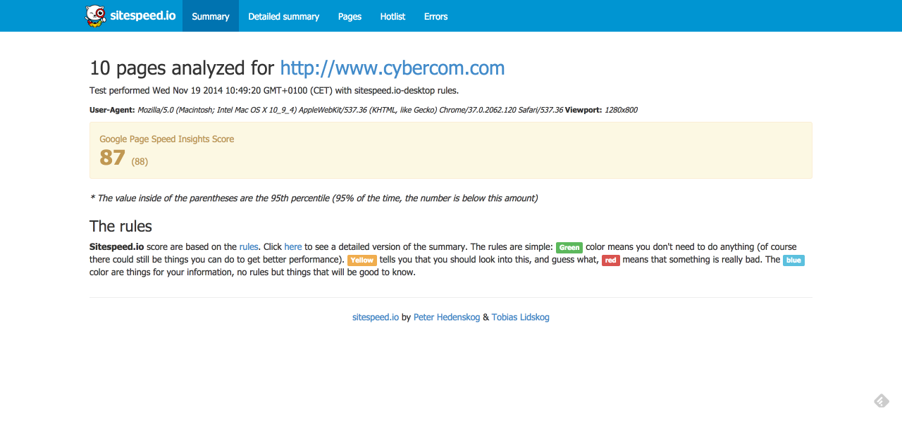
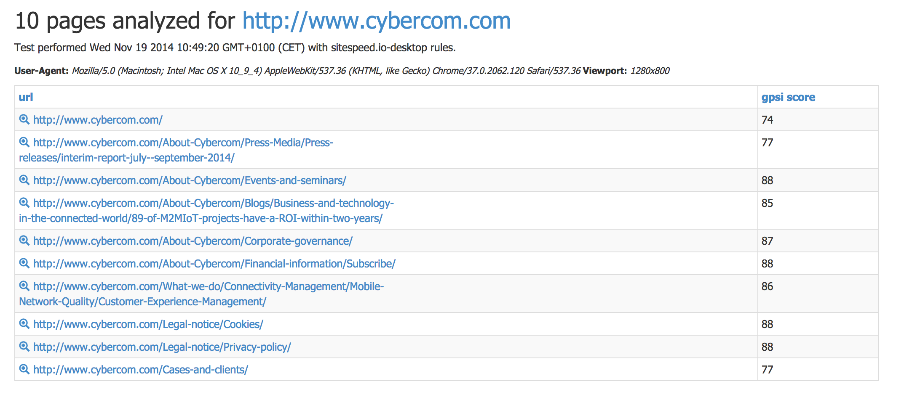
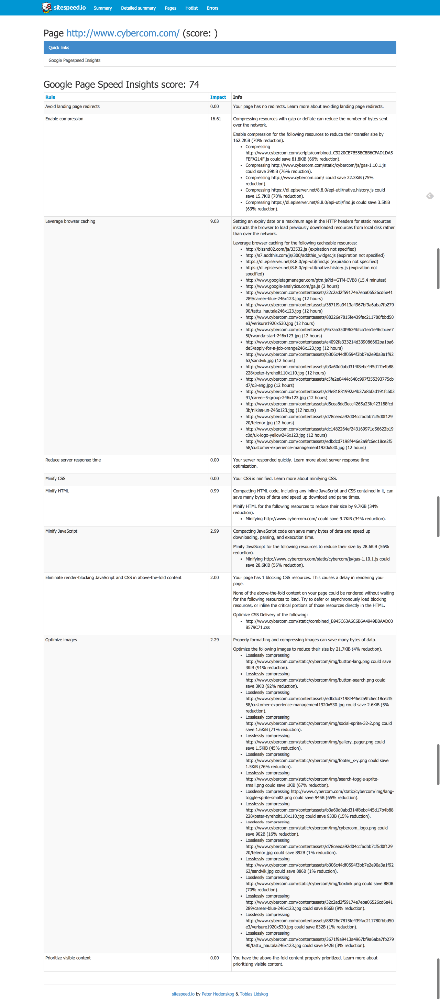

[Documentation 3.x](/documentation/) / GPSI

# Google Page Speed Insights
{:.no_toc}

* Lets place the TOC here
{:toc}

Google Page Speed Insights (GPSI) is Google:s rule/best practices rules to build a web site that are as fast as possible. Follow the rules and your site will be fast.

Sitespeed.io integrates GPSI so you can fetch how good your site is doing. Two things: Your site needs to reachable from the internet (and no basic authentication) and you need to supply your own [Google key](https://console.developers.google.com/project).

Run it like this:

~~~bash
$ sitespeed.io -u http://yoursite.com  --gpsiKey MY_SECRET_KEY
~~~

Sitespeed.io will collect all available data from GPSI. On the summary page, the GPSI score will be shown. We also collect number of requests. You can check the implementation [here](https://github.com/sitespeedio/sitespeed.io/tree/master/lib/aggregators/gpsi) and add an issue if you want us to collect more data:

{: .img-thumbnail}

On the pages summary, you will also automatically the GPSI score:

{: .img-thumbnail}

And on the detailed summary page, we show all the data that are provided by GPSI, it looks like this:

{: .img-thumbnail}
