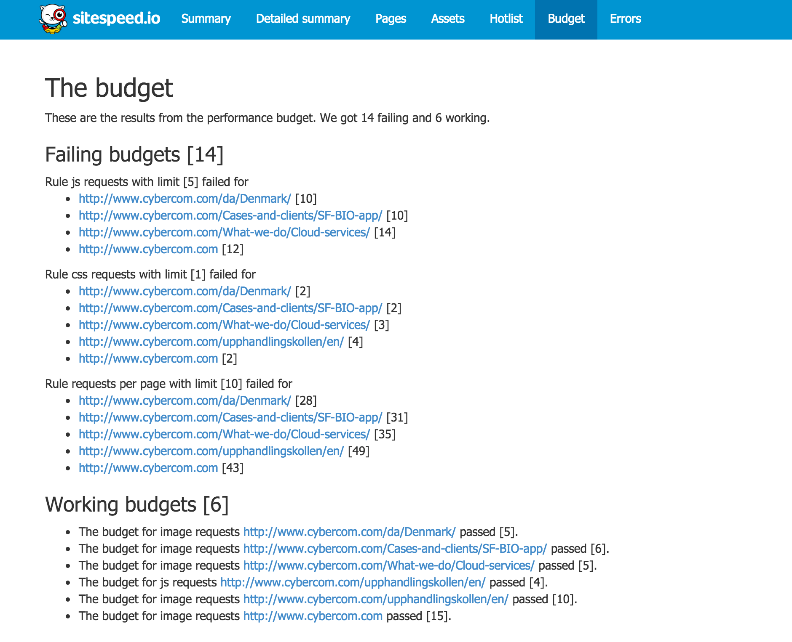

[Documentation 3.x](/documentation/) / Performance Budget

# Performance Budget
{:.no_toc}

* Lets place the TOC here
{:toc}

## Performance budget
Have you heard of a performance budget? If not, please read the excellent posts by Tim Kadlec [Setting a performance budget](http://timkadlec.com/2013/01/setting-a-performance-budget/) and [Fast enough](http://timkadlec.com/2014/01/fast-enough/). Also read Daniel Malls [How to make a performance budget](http://danielmall.com/articles/how-to-make-a-performance-budget/). After that, continue setup sitespeed.io :)

### How it works
When you run sitespeed.io configured with a budget, the script will exit with a exit status > 0 if the budget fails. It will log the budget items that are failing and the ones that are working, and create a HTML report for the budget.

The log will look something like this:

~~~
error: The budget for js requests http://www.cybercom.com/da/Denmark/ failed. The number of js requests 10 the limit is 5
error: The budget for css requests http://www.cybercom.com/da/Denmark/ failed. The number of css requests 2 the limit is 1
error: The budget for requests per page http://www.cybercom.com/da/Denmark/ failed. The number of requests is 28 and the limit is 10
info: The budget for image requests http://www.cybercom.com/da/Denmark/ passed [5]
error: The budget for js requests http://www.cybercom.com/Cases-and-clients/SF-BIO-app/ failed. The number of js requests 10 the limit is 5
...
~~~

And the report looks like this.

{: .img-thumbnail}

Lets see how you can configure your budgets.

### Testing timings
If you have a budget where you want to test the (RUM) speed index, you add a file like this:

~~~
{
  "timings": {
    "speedIndex": 1000
  }
}
~~~
Then run it like this:

~~~bash
$ sitespeed.io -u https://www.sitespeed.io --budget myBudget.json -b chrome -n 11
~~~

You can test all timings produced by BrowserTime like *domContentLoadedTime* or *backEndTime*.

### Testing user timings
You can have a budget for your own User Timings metrics. For www.sitespeed.io we have two user timing metrics: *logoTime* and *headerTime*. You can add them to the budget like this:

~~~
{
  "timings": {
    "headerTime": 800,
    "logoTime": 500
  }
}
~~~

And they will be tested and matched against your configured value.

### Using WebPageTest
If you are using WebPageTest, you can setup a budget matching almost whatever WPT fetches but the most useable things are testing the number of requests, size, TTFB and the speed index score. To test all these four things, you add a JSON file looking like this:

~~~
{
  "wpt" : {
    "requests": 60,
    "TTFB": 200,
    "bytesIn": 1000000,
    "SpeedIndex" : 1000
  }
}
~~~

And change the values to what you want to test. In this example the budget will blow if we have more that 60 requests on a page, a time to first byte larger than 200 ms, a page weight more than 1000 kb and a speed index score larger than 1000.
