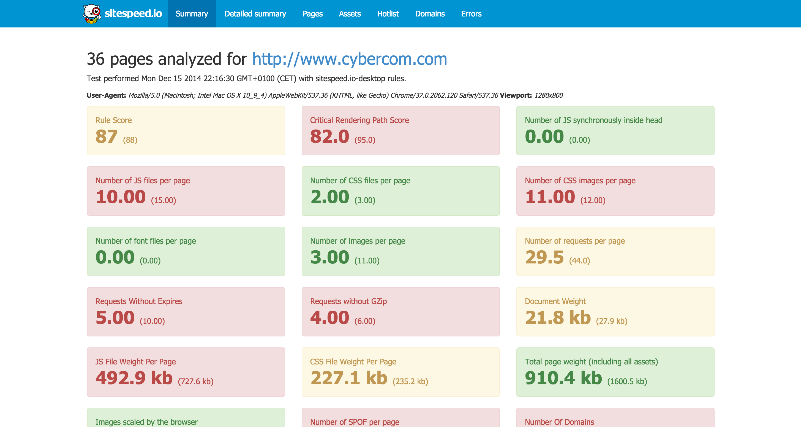
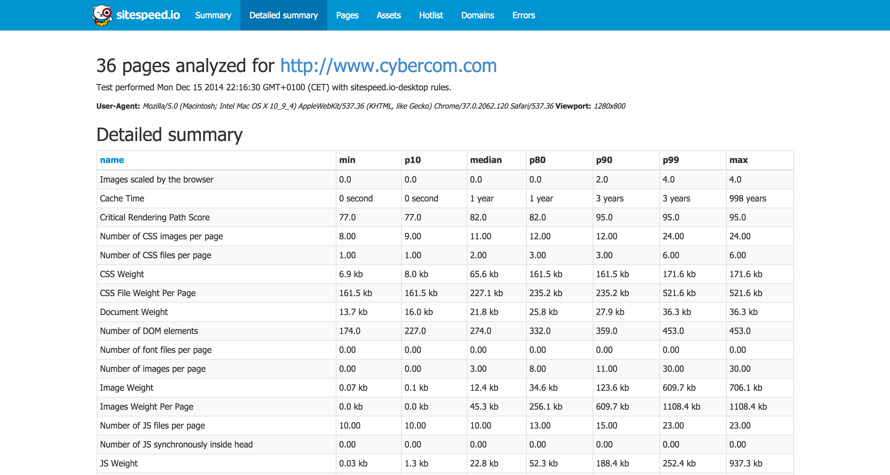
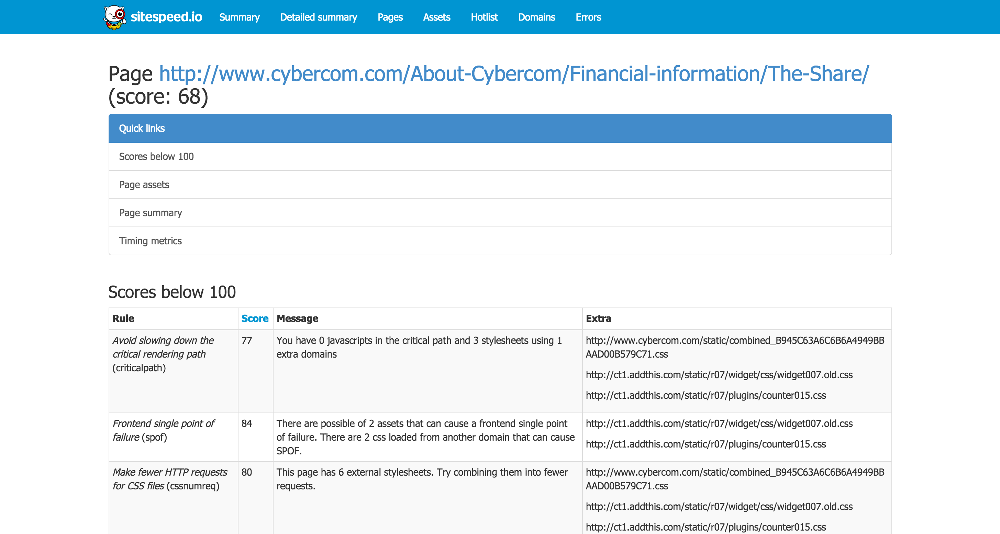
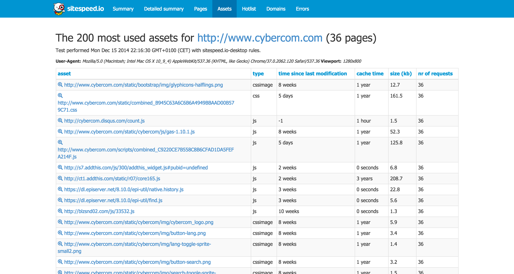
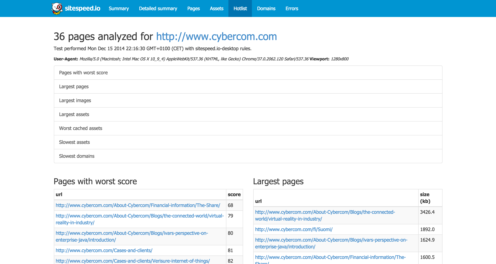
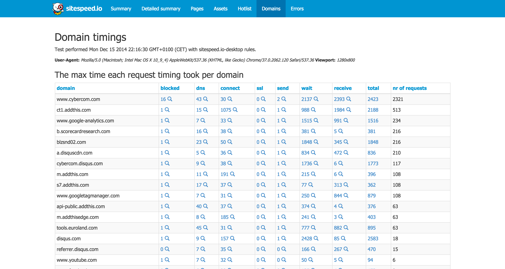

[Documentation 3.x](/documentation/) / Result

# The Result
{:.no_toc}

* Lets place the TOC here
{:toc}

# HTML
The result of an analyze can be a couple of HTML pages, JUnit XML/TAP and you can
send the metrics to [Graphite](#graphite). Lets first checkout the different HTML pages.

## Site summary page

The summary page is a executive summary page where green is good, yellow means that you should look into it and red is bad (sometimes really bad). The page shows a summary of best practices for good web site performance (and site speed metrics if configured). You can choose which boxes/best practices that will be shown on this page, so you can create different views for different use cases.

{: .img-thumbnail}

## The detailed summary page

The detailed summary page will give you almost all the metrics you want for you site. You will get the average, 10th percentile, median, 95th percentile, min, max and standard deviation value for each metrics (this page is based on the **summary.json** file, where you also will find the variance and the 90th percentile, if ever needed when comparing metrics).

{: .img-thumbnail}

## Detailed site report

The detailed site report page shows data collected for each page. You can configure which metrics/data that you want to show in the columns, so you can choose what is extra important for you.

{: .img-thumbnail}

## Full page analyzes

Every page that is tested, also get a corresponding HTML page, where all in deep data is shown. Checkout the [examples](/example/) section to see what it looks like.

{: .img-thumbnail}

## Most used assets report
The most used assets report show you the most used assets (a.k.a which asset should you start to change to get the most bang for the money).

You will see the following for each asset: the type, the time since last modification, the cache time, the weight and the number of times the asset has been used.

{: .img-thumbnail}

## Hotlist
The hotlist is a way of trying to find bad pages/assets that you should focus on to get better performance.

{: .img-thumbnail}

## Domains
If you fetch timings using your browser, the domains page will be created, that shows timings per domain, making it easier to spot 3rd party domains that is slow.

{: .img-thumbnail}

## Screenshots

You can choose to take screenshots of every tested page for the used viewport.

# JSON
All collected data will be stored as a fat JSON file in your data directory if you add *storeJson* when you run sitespeed.io. That is good if you yourself want to harvest the data from the result.

# Graphite
Most of the collected metrics can be stored in Graphite, making it easy for you to graph the metrics. Checkout the [Graph section](/documentation/graphs/).

# TAP and JUnit XML
You can create TAP or JUnit XML from your analyze, head over to the [Continuous Integration section](/documentation/continuous-integration/#generating-junit-xml-or-tap).
