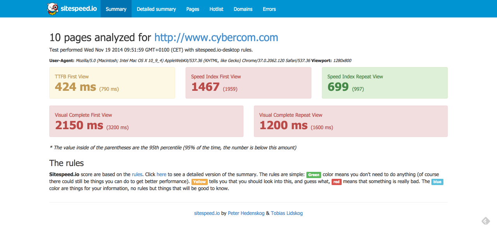
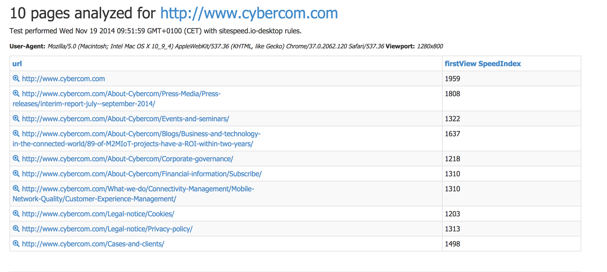
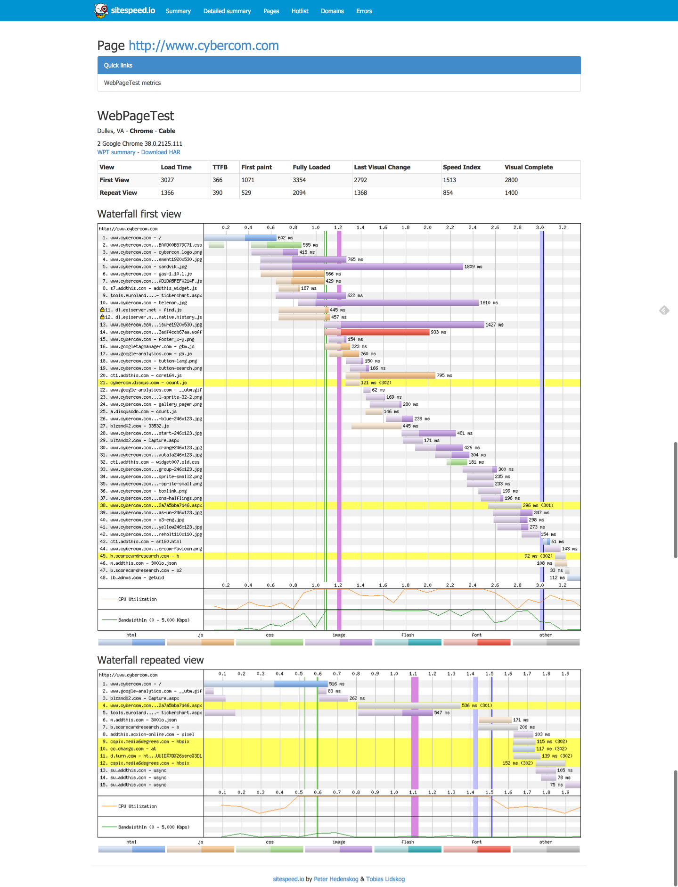

[Documentation 3.x](/documentation/) / WebPageTest

# WebPageTest
{:.no_toc}

* Lets place the TOC here
{:toc}

# Using WebPageTest
Yep we all love [WebPageTest](http://www.webpagetest.org) (WPT), so we made it possible to drive an instance of and collect the data from it.

To use WPT you can either get an [API key](http://www.webpagetest.org/getkey.php) (sponsored by Akamai) for the global version or follow Pat Meenans instructions on [how to get a private version up and running in 5 minutes](http://calendar.perfplanet.com/2014/webpagetest-private-instances-in-five-minutes/).

Out of the it will collect [these](https://github.com/sitespeedio/sitespeed.io/tree/master/lib/aggregators/webpagetest) metrics that can be displayed on the summary page. By default, these will be shown:

{: .img-thumbnail}

On the pages summary, you will also automatically get the SpeedIndex score:

{: .img-thumbnail}

And on the detailed summary page, we show some interesting metrics and the waterfalls
for the median result of both first and repeated view:

{: .img-thumbnail}

## Configuration
There is some default configuration that is passed to WebPageTest. It looks like this:

~~~
{
  pollResults: 10,
  timeout: 600,
  firstViewOnly: false,
  runs: n, // the number of times passed by -n, default 3
  private: true,
  aftRenderingTime: true,
  location: 'Dulles:Chrome',
  video: true
}
~~~

And if basic auth is set, it is passed as basic auth.

In the background the test method in Marcel Durans webpagetest-api is used, so you can configure almost everything. Checkout the docs [here](https://github.com/marcelduran/webpagetest-api#user-content-test-works-for-test-command-only). You configure your own stuff by feeding sitespeed.io with a JSON file. Say you want to test form Dulles using a throttled 3G connection:

~~~
{
  "location": "Dulles:Firefox",
  "connectivity": "3G"
}
~~~
The default location will be overidden and the connectivity will be set to 3G.
Feed it with: *--wptConfig yourFile.json*

If you want to test from multiple locations, browsers or different connectivity, pass an array as configuration:

~~~
[
  {
    "location": "Dulles:Firefox",
    "connectivity": "3G"
  },
  {
    "location": "Dulles:Chrome",
    "connectivity": "Cable"
  }
]
~~~

### WebPageTest scripting
WebPageTest has scripting capability where you can automate a multi-step test (=login the user and do stuff). That is supported by sitespeed.io by supplying the script. Do like this. Create your script file (checkout WebPageTest [documentation](https://sites.google.com/a/webpagetest.org/docs/using-webpagetest/scripting)). It can look something like this (wptScript.txt):

~~~
logData    0

// put any urls you want to navigate
navigate    www.aol.com
navigate    news.aol.com

logData    1

// this step will get recorded
navigate    news.aol.com/world
~~~

Then change your URL you want test (probably the last one) to \{\{\{URL\}\}\} and then all occurrences of &#123;&#123;&#123;URL&#125;&#125;&#125; will then be replaced with the current URL that should be tested.
Then run sitespeed (and add the parameters as you usually do):

~~~
sitespeed.io --wptScript wptScript.txt --wptHost my.wpt.host.com -u http://example.org
~~~

### Custom metrics
Hey we love custom metrics and you can fetch them using WPT. Checkout the [metrics docs](https://sites.google.com/a/webpagetest.org/docs/using-webpagetest/custom-metrics) for WPT and then create a file containing your metrics:

~~~
[iframe-count]
return document.getElementsByTagName("iframe").length;

[script-tag-count]
return document.getElementsByTagName("script").length;

[meta-viewport]
var viewport = undefined;
var metaTags=document.getElementsByTagName("meta");
for (var i = 0; i < metaTags.length; i++) {
    if (metaTags[i].getAttribute("name") == "viewport") {
        viewport = metaTags[i].getAttribute("content");
        break;
    }
}
return viewport;
~~~

Then run sitespeed.io like this:

~~~
sitespeed.io --wptCustomMetrics myScriptFile.txt --wptHost my.wpt.host.com
~~~

The custom metrics will show up on the individual page and sent to Graphite.

## Graph the WPT metrics
The data collected and showed can also be sent to Graphite. Checkout the Graphite [section](#graphite-full).

## WPT performance budget
The timings and metrics collected by WebPageTest can also be used in you performance budget. More info [budget](#budget).

## Timing metrics collected using WPT
All the metrics are collected both for first and repeated view.

* *firstPaint* - the time from the start of navigation until the first non-white content was painted to the screen
* *loadTime* - the time from the start of the initial navigation until the beginning of the window load event (onload)
* *TTFB* - the time from the start of navigation until the first byte of the base page is returned (after following any redirects)
* *SpeedIndex* - is the average time at which visible parts of the page are displayed. It is expressed in milliseconds and dependent on size of the view port. You need to [read more](https://sites.google.com/a/webpagetest.org/docs/using-webpagetest/metrics/speed-index) to fully understand how it works.
* *VisualComplete*
