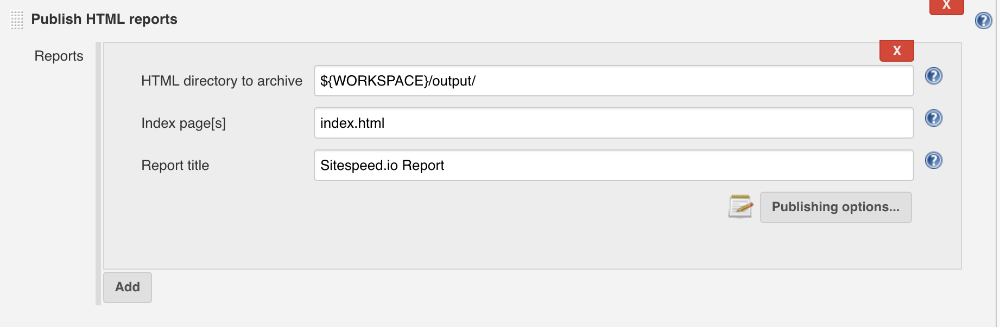
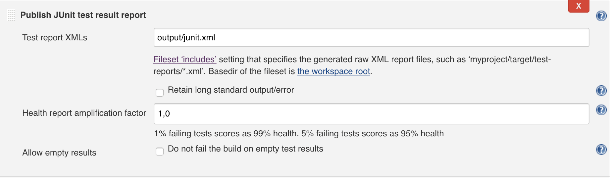

[Documentation]({{site.baseurl}}/documentation/sitespeed.io/) / Continuous Integration

# Continuous Integration
{:.no_toc}

* Lets place the TOC here
{:toc}

Use sitespeed.io to keep track of what is happening with your site and make sure you know that you don’t break the performance best practice rules before your changes are released. Your build can also be broken if has too many assets, are too big or too slow. And of course, if you use WebPageTest you can use the metrics from them to break your build.

You can define your own [budget file](({{site.baseurl}}/documentation/sitespeed.io/performance-budget/)) with rules on when to break your build. You will get an error return status after the run or you can choose to output JUnit XML and TAP.

## Jenkins
The easiest way to run in Jenkins is to use the pre built Docker containers. You can run an installed npm version too, but then you need to use the [Xvfb plugin](https://wiki.jenkins-ci.org/display/JENKINS/Xvfb+Plugin) to make it running headless.

### Setup
* Choose *New Item* and create a new freestyle project.
* Choose *Add build step* in the Build part and Execute shell you will have a box where you add your CLI magic. Remember that the Jenkins user needs to be able to run Docker or else you need to switch user.
* We map the Jenkins workspace with the output folder in Docker so the HTML result is visible outside of the container.

~~~bash
docker run --privileged -v ${WORKSPACE}:/sitespeed.io sitespeedio/sitespeed.io --outputFolder output https://www.sitespeed.io/ -n 1
~~~

* You can then install the **Publish HTML Reports** plugin to make the reports easy available in Jenkins. Add it as a *Post-build Actions* and set the **HTML directory to archive** to *${WORKSPACE}/output/* and it will work fine.

{: .img-thumbnail}

* If you want to break your build, you should generate a JUnit XML and use the built in post task *Publish JUnit test result report*. Make sure to make the budget file available inside the Docker container. In this example we have it inside the Jenkins workspace.

~~~bash
docker run --privileged -v ${WORKSPACE}:/sitespeed.io sitespeedio/sitespeed.io --outputFolder output --budget /sitespeed.io/budget.json --budget.output junit https://www.sitespeed.io/ -n 1
~~~

And then you can setup the JUnit report like this:

{: .img-thumbnail}

Remember that you can send the metrics to Graphite to keep a closer look at all the metrics.

## Travis
Coming soon.

## Grunt plugin
Checkout the [grunt plugin](https://github.com/sitespeedio/grunt-sitespeedio)!

## Gulp plugin
Coming soon.
